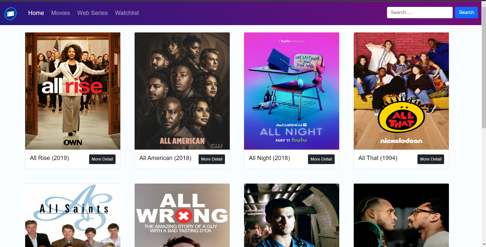
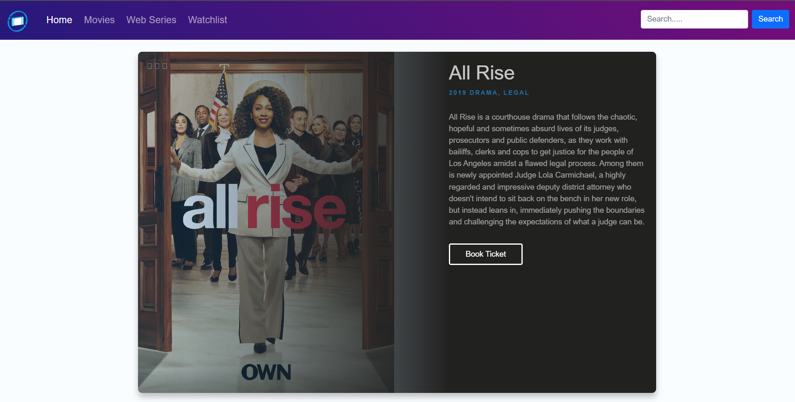

# ShowBooker React App

## Overview

ShowBooker is a React app that serves as a TV show booking platform, allowing users to discover and book tickets for their favorite TV shows. The app utilizes the TVMaze API to fetch information about TV shows, including details about episodes, cast, and more.

## Screenshots



## Features

- **Browse TV Shows:** Explore a vast catalog of TV shows available through the TVMaze API.
- **Show Details:** View detailed information about each TV show.
- **Booking Tickets:** Reserve tickets for upcoming episodes of your favorite shows.
- **User-Friendly Interface:** Intuitive and responsive UI for an optimal user experience.

## Getting Started

To run the app locally, follow these steps:

1. Clone the repository:

   ```bash
   git clone https://github.com/shubham-senani/Showbooker-React-App.git
   ```


## Installation

## 1. Create a React App

```bash
npm init vite@latest
```

## 2. Install dependencies

```bash
npm install
```

## 3. Start development server

```bash
npm start
```

## 4. Build for production

```bash
npm run build
```
